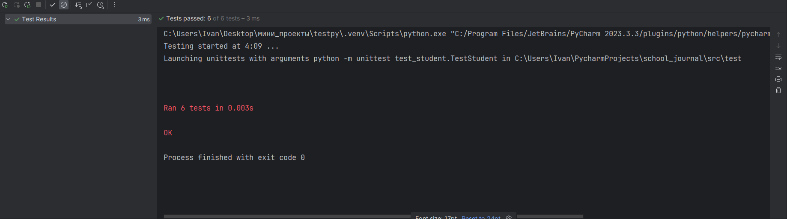

# Лабораторная №4


### Файл `exceptions.py`

Этот файл содержит пользовательские классы исключений, которые используются в школьном журнале для обработки различных ошибок. Предоставляет исключения для разных типов ошибок.

#### Классы исключений:

- **SchoolJournalError**  
  Базовый класс для всех исключений, связанных с школьным журналом.

- **InvalidDateError**  
  Исключение, выбрасываемое при неверном формате даты.

- **InvalidGradeError**  
  Исключение, выбрасываемое при попытке добавить или обновить оценки с некорректными значениями.

- **StudentNotFoundError**  
  Исключение, выбрасываемое, когда указанный студент не найден в школьном журнале.

- **SubjectNotFoundError**  
  Исключение, выбрасываемое, когда предмет не найден у студента.

- **InvalidInputError**  
  Исключение, выбрасываемое при некорректном вводе данных.


### Структура тестов

#### Тесты для отдельных компонентов:

- **test_student.py**  
  Тесты для класса `Student`, проверяющие создание объекта, обработку ошибок и работу с оценками.

- **test_school_journal.py**  
  Тесты для класса `SchoolJournal`, проверяющие добавление студентов и управление оценками.

- **test_numerology.py**  
  Тесты для модуля `numerology`, проверяющие корректность расчета знаков зодиака и возраста в днях.

#### Интеграционные тесты:

- **test_integration.py**  
  Интеграционные тесты, проверяющие взаимодействие компонентов: студенты, школьный журнал и модуль нумерологии.

# Успешное прохождение тестов:


## Для запуска всех тестов необходимо ввести команду:
```bash 
python -m unittest discover -s src/test
